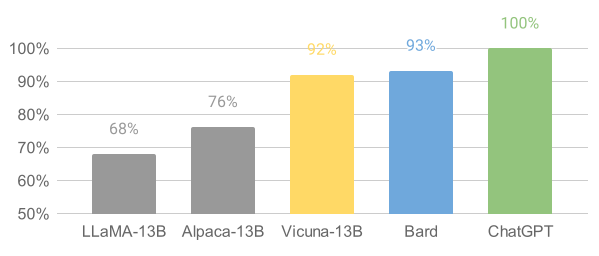
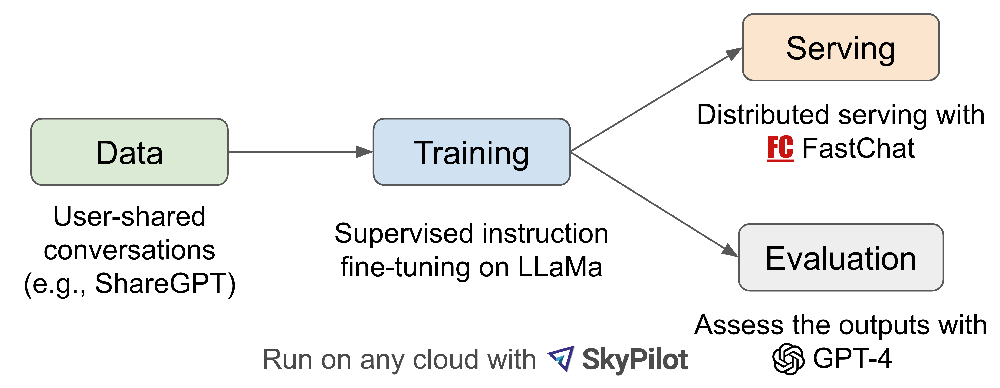
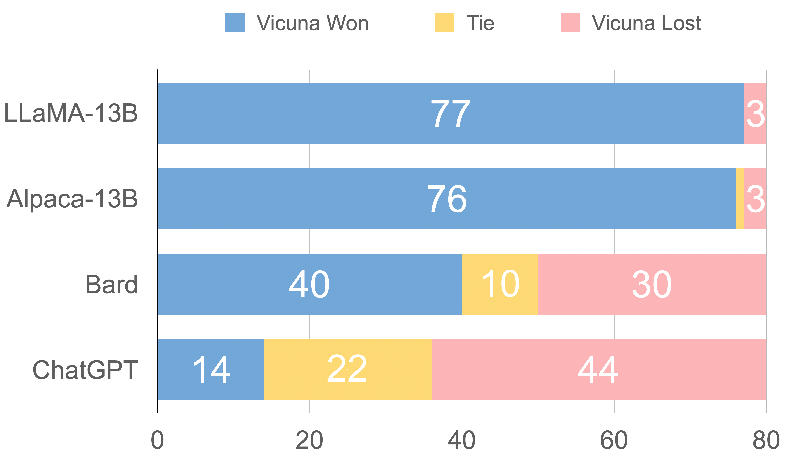

<sup>\*</sup> *According to a fun and non-scientific evaluation with GPT-4. Further rigorous evaluation is needed.*
{: style="color:gray;"}

We introduce Vicuna-13B, an open-source chatbot trained by fine-tuning LLaMA on user-shared conversations collected from ShareGPT. Preliminary evaluation using GPT-4 as a judge shows Vicuna-13B achieves more than 90%<sup>*</sup> quality of OpenAI ChatGPT and Google Bard while outperforming other models like LLaMA and Stanford Alpaca in more than 90%<sup>*</sup> of cases. The cost of training Vicuna-13B is around $300. The training and serving [code](https://github.com/lm-sys/FastChat), along with an online [demo](https://chat.lmsys.org), are publicly available for non-commercial use.


{: style="display:block; margin-left: auto; margin-right: auto;" width="30%"}

Vicuna
(generated by stable diffusion 2.1)
{: style="color:gray; text-align: center;"}


## How Good is Vicuna? 
We present examples of Alpaca and Vicuna responses to our benchmark questions. After fine-tuning Vicuna with 70K user-shared ChatGPT conversations, we discover that Vicuna becomes capable of generating more detailed and well-structured answers compared to Alpaca (see examples below), with the quality on par with ChatGPT.

---


<style type="text/css">
.tg  {border-collapse:collapse;border-spacing:0;margin:0px auto;}
.tg td{border-color:#ccc;border-style:solid;border-width:1px;
  overflow:hidden;padding:10px 5px;word-break:normal;}
.tg .tg-head{background-color:#c0c0c0;border-color:#ccc;text-align:left;vertical-align:top;}
.tg .tg-body{text-align:left;vertical-align:top;}
</style>

---

However, evaluating chatbots is never a simple task. With recent advancements in GPT-4, we are curious whether its capabilities have reached a human-like level that could enable an automated evaluation framework for benchmark generation and performance assessments. Our initial finding indicates that GPT-4 can produce highly consistent ranks and detailed assessment when comparing chatbots’ answers (see above example of GPT-4 judgment). 
Preliminary evaluations based on GPT-4, summarized in Figure 1, show that Vicuna achieves 90%<sup>*</sup> capability of Bard/ChatGPT. While this proposed framework shows a potential to automate chatbot assessment, **it is not yet a rigorous approach**. Building an evaluation system for chatbots remains an open question requiring further research. More details are provided in the evaluation section.


{: style="display:block; margin-left: auto; margin-right: auto;" width="60%"}
Figure 1. Relative Response Quality Assessed by GPT-4<sup>*</sup>
{: style="color:gray; text-align: center;"}


## Online Demo
Try the Vicuna-13B demo [here](https://chat.lmsys.org)!

<!-- Add a video that automatically play -->
<div>
  <a href="https://chat.lmsys.org"  style="display: flex;justify-content: center;">
  <video autoplay muted loop src="assets/vicuna/demo-narrow.mp4" type="video/mp4" style="width: 80%;" id="demo">
  </video>
  </a>
</div>


## Overview
The rapid advancement of large language models (LLMs) has revolutionized chatbot systems, resulting in unprecedented levels of intelligence as seen in OpenAI's ChatGPT. However, despite its impressive performance, the training and architecture details of ChatGPT remain unclear, hindering research and open-source innovation in this field. Inspired by the Meta LLaMA and Stanford Alpaca project, we introduce Vicuna-13B, an open-source chatbot backed by an enhanced dataset and an easy-to-use, scalable infrastructure. By fine-tuning a LLaMA base model on user-shared conversations collected from ShareGPT.com, Vicuna-13B has demonstrated competitive performance compared to other open-source models like Stanford Alpaca. This blog post provides a preliminary evaluation of Vicuna-13B's performance and describes its training and serving infrastructure. We also invite the community to interact with our online demo to test the capabilities of this chatbot.


{: style="display:block; margin-left: auto; margin-right: auto;" width="70%"}
Figure 2. Workflow Overview
{: style="color:gray; text-align: center;"}

Figure 2 provides an overview of our work. To begin, we collected around 70K conversations from ShareGPT.com, a website where users can share their ChatGPT conversations. Next, we enhanced the training scripts provided by Alpaca to better handle multi-round conversations and long sequences. The training was done with PyTorch FSDP on 8 A100 GPUs in one day. For serving the demo, we implemented a lightweight distributed serving system. We conducted a preliminary evaluation of the model quality by creating a set of 80 diverse questions and utilizing GPT-4 to judge the model outputs. To compare two different models, we combine the outputs from each model into a single prompt for each question. The prompts are then sent to GPT-4, which assesses which model provides better responses. A detailed comparison of LLaMA, Alpaca, ChatGPT, and Vicuna is shown in Table 1 below.


Table 1. Comparison between several notable models
{: style="color:gray; text-align: center;"}


<table class="tg" style="display: flex;justify-content: center;">
<tbody>
  <tr>
    <td class="tg-head"><span style="font-weight:bold;">Model Name</span></td>
    <td class="tg-head"><span style="font-weight:bold;">LLaMA</span></td>
    <td class="tg-head"><span style="font-weight:bold;">Alpaca</span></td>
    <td class="tg-head"><span style="font-weight:bold;">Vicuna</span></td>
    <td class="tg-head"><span style="font-weight:bold;">Bard/ChatGPT</span></td>
  </tr>
  <tr>
    <td class="tg-body">Dataset</td>
    <td class="tg-body">Publicly available datasets<br>(1T token)</td>
    <td class="tg-body">Self-instruct from davinci-003 API<br>(52K samples)</td>
    <td class="tg-body">User-shared conversations<br>(70K samples)</td>
    <td class="tg-body">N/A</td>
  </tr>
  <tr>
    <td class="tg-body">Training code</td>
    <td class="tg-body">N/A</td>
    <td class="tg-body">Available</td>
    <td class="tg-body">Available</td>
    <td class="tg-body">N/A</td>
  </tr>
  <tr>
    <td class="tg-body">Evaluation metrics</td>
    <td class="tg-body">Academic benchmark</td>
    <td class="tg-body">Author evaluation</td>
    <td class="tg-body">GPT-4 assessment</td>
    <td class="tg-body">Mixed</td>
  </tr>
  <tr>
    <td class="tg-body">Training cost<br>(7B)</td>
    <td class="tg-body">82K GPU-hours</td>
    <td class="tg-body">$500 (data) + $100 (training)</td>
    <td class="tg-body">$140 (training)</td>
    <td class="tg-body">N/A</td>
  </tr>
  <tr>
    <td class="tg-body">Training cost<br>(13B)</td>
    <td class="tg-body">135K GPU-hours</td>
    <td class="tg-body">N/A</td>
    <td class="tg-body">$300 (training)</td>
    <td class="tg-body">N/A</td>
  </tr>
</tbody>
</table>

## Training
Vicuna is created by fine-tuning a LLaMA base model using approximately 70K user-shared conversations gathered from ShareGPT.com with public APIs. To ensure data quality, we convert the HTML back to markdown and filter out some inappropriate or low-quality samples. Additionally, we divide lengthy conversations into smaller segments that fit the model's maximum context length.

Our training recipe builds on top of [Stanford’s alpaca](https://crfm.stanford.edu/2023/03/13/alpaca.html) with the following improvements.
- **Memory Optimizations:** To enable Vicuna's understanding of long context, we expand the max context length from 512 in alpaca to 2048, which substantially increases GPU memory requirements. We tackle the memory pressure by utilizing [gradient checkpointing](https://arxiv.org/abs/1604.06174) and [flash attention](https://arxiv.org/abs/2205.14135).
- **Multi-round conversations:** We adjust the training loss to account for multi-round conversations and compute the fine-tuning loss solely on the chatbot's output.
- **Cost Reduction via Spot Instance:** The 40x larger dataset and 4x sequence length for training poses a considerable challenge in training expenses. We employ [SkyPilot](https://github.com/skypilot-org/skypilot) [managed spot](https://skypilot.readthedocs.io/en/latest/examples/spot-jobs.html) to reduce the cost by leveraging the cheaper spot instances with auto-recovery for preemptions and auto zone switch. This solution slashes costs for training the 7B model from $500 to around $140 and the 13B model from around $1K to $300.


## Serving
We build a serving system that is capable of serving multiple models with distributed workers. It supports flexible plug-in of GPU workers from both on-premise clusters and the cloud. By utilizing a fault-tolerant controller and managed spot feature in SkyPilot, this serving system can work well with cheaper spot instances from multiple clouds to reduce the serving costs. It is currently a lightweight implementation and we are working on integrating more of our latest [research](https://arxiv.org/abs/2302.11665) into it.

## How To Evaluate a Chatbot?
Evaluating AI chatbots is a challenging task, as it requires examining language understanding, reasoning, and context awareness. With AI chatbots becoming more advanced, current open benchmarks may no longer suffice. For instance, the evaluation dataset used in Stanford’s Alpaca, [self-instruct](https://github.com/yizhongw/self-instruct/tree/main/human_eval), can be effectively answered by SOTA chatbots, making it difficult for humans to discern differences in performance. More limitations include training/test data contamination and the potentially high cost of creating new benchmarks. To tackle these issues, we propose an evaluation framework based on GPT-4 to automate chatbot performance assessment.


First, we devised eight question categories, such as Fermi problems, roleplay scenarios, and coding/math tasks, to test various aspects of a chatbot's performance. Through careful prompt engineering, GPT-4 is able to generate diverse, challenging questions that baseline models struggle with. We select ten questions per category and collect answers from five chatbots: LLaMA, Alpaca, ChatGPT, Bard, and Vicuna. We then ask GPT-4 to rate the quality of their answers based on helpfulness, relevance, accuracy, and detail. We discover that GPT-4 can produce not only relatively consistent scores but also detailed explanations on why such scores are given (detailed examples [link](https://vicuna.lmsys.org/eval)). However, we also notice that GPT-4 is not very good at judging coding/math tasks.

{: style="display: flex; margin-left: auto; margin-right: auto; width: 50%;"}
Figure 3. Response Comparison Assessed by GPT-4
{: style="color:gray; text-align: center;"}

Figure 3 displays the comparison results between all baselines and Vicuna. GPT-4 prefers Vicuna over state-of-the-art open-source models (LLaMA, Alpaca) in more than 90% of the questions, and it achieves competitive performance against proprietary models (ChatGPT, Bard). In 45% of the questions, GPT-4 rates Vicuna's response as better or equal to ChatGPT's.
As GPT-4 assigns a quantitative score to each response on a scale of 10, we calculate the total score for each (baseline, Vicuna) comparison pair by adding up the scores obtained by each model on 80 questions. As shown in Table 2, Vicuna’s total score is 92% of ChatGPT’s. Despite recent advancements, these chatbots still face limitations, such as struggling with basic math problems or having limited coding ability.

Table 2. Total Scores Assessed by GPT-4. 
{: style="color:gray; text-align: center;"}

<table class="tg" style="display: flex;justify-content: center;">
<tbody>
  <tr>
    <td class="tg-head"><span style="font-weight:bold;">Baseline</span></td>
    <td class="tg-head"><span style="font-weight:bold;">Baseline Score</span></td>
    <td class="tg-head"><span style="font-weight:bold;">Vicuna Score</span></td>
  </tr>
  <tr>
    <td class="tg-body">LLaMA-13B</td>
    <td class="tg-body" style="text-align: right">513.0</td>
    <td class="tg-body" style="text-align: right"><span style="font-weight:bold;">694.0</span></td>
  </tr>
  <tr>
    <td class="tg-body">Alpaca-13B</td>
    <td class="tg-body" style="text-align: right">583.0</td>
    <td class="tg-body" style="text-align: right"><span style="font-weight:bold;">704.0</span></td>
  </tr>
  <tr>
    <td class="tg-body">Bard</td>
    <td class="tg-body" style="text-align: right"><span style="font-weight:bold;">664.0</span></td>
    <td class="tg-body" style="text-align: right">655.5</td>
  </tr>
  <tr>
    <td class="tg-body">ChatGPT</td>
    <td class="tg-body" style="text-align: right"><span style="font-weight:bold;">693.0</span></td>
    <td class="tg-body" style="text-align: right">638.0</td>
  </tr>
</tbody>
</table>
<br>

While this proposed evaluation framework demonstrates the potential for assessing chatbots, it is not yet a rigorous or mature approach, as large language models are prone to hallucinate. Developing a comprehensive, standardized evaluation system for chatbots remains an open question requiring further research.

## Limitations
We have noticed that, similar to other large language models, Vicuna has certain limitations. For instance, it is not good at tasks involving reasoning or mathematics, and it may have limitations in accurately identifying itself or ensuring the factual accuracy of its outputs. Additionally, it has not been sufficiently optimized to guarantee safety or mitigate potential toxicity or bias. To address the safety concerns, we use the OpenAI [moderation](https://platform.openai.com/docs/guides/moderation/overview) API to filter out inappropriate user inputs in our online demo. Nonetheless, we anticipate that Vicuna can serve as an open starting point for future research to tackle these limitations.

## Release
In our first release, we will share the training, serving, and evaluation code on a GitHub repo: [https://github.com/lm-sys/FastChat](https://github.com/lm-sys/FastChat).
We also released the Vicuna-13B model weights, please find the instructions [here](https://github.com/lm-sys/FastChat#vicuna-weights).
There is no plan to release the dataset.
Join our [Discord](https://discord.gg/h6kCZb72G7) server and follow our [Twitter](https://twitter.com/lmsysorg) to get the latest updates.

## License
The online demo is a research preview intended for non-commercial use only, subject to the model [License](https://github.com/facebookresearch/llama/blob/main/MODEL_CARD.md) of LLaMA, [Terms of Use](https://openai.com/policies/terms-of-use) of the data generated by OpenAI, and [Privacy Practices](https://chrome.google.com/webstore/detail/sharegpt-share-your-chatg/daiacboceoaocpibfodeljbdfacokfjb) of ShareGPT. Please contact us If you find any potential violation.\\
The code is released under the Apache License 2.0.

## The Team
This is a joint effort with collaborators from multiple institutions, including UC Berkeley, CMU, Stanford, UC San Diego, and MBZUAI.

**Students (alphabetical order):**\\
Wei-Lin Chiang, Zhuohan Li, Zi Lin, Ying Sheng, Zhanghao Wu, Hao Zhang, Lianmin Zheng, Siyuan Zhuang, Yonghao Zhuang

**Advisors (alphabetical order):**\\
Joseph E. Gonzalez, Ion Stoica, Eric P. Xing


## Acknowledgment
We would like to thank Xinyang Geng, Hao Liu, and Eric Wallace from BAIR; Xuecheng Li, and Tianyi Zhang from Stanford Alpaca team for their insightful discussion and feedback. Please check out a blog post from BAIR about a concurrent effort on their chatbot, [Koala](https://bair.berkeley.edu/blog/2023/04/03/koala/).


## Citation
```
@misc{vicuna2023,
    title = {Vicuna: An Open-Source Chatbot Impressing GPT-4 with 90%* ChatGPT Quality},
    url = {https://vicuna.lmsys.org},
    author = {Chiang, Wei-Lin and Li, Zhuohan and Lin, Zi and Sheng, Ying and Wu, Zhanghao and Zhang, Hao and Zheng, Lianmin and Zhuang, Siyuan and Zhuang, Yonghao and Gonzalez, Joseph E. and Stoica, Ion and Xing, Eric P.},
    year = {2023}
}
```
